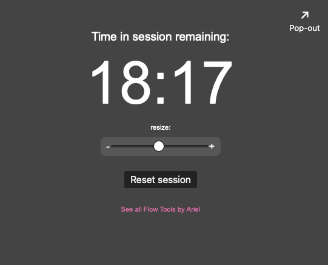

# FocusTime

Welcome to **FocusTime** — a lightweight session timer designed to complement **Focusmate** and help you stay locked in during virtual coworking sprints.

I built this because I wanted a timer that respected my schedule, not the other way around. With FocusTime, you set when your next session starts and how long it lasts — and it does the rest.

**FocusTime** counts you in, keeps you focused, and gently alerts you when your time is almost up.

No logins. No ads. No guilt. Just a clean, flexible timer that works the way you do.

[**See it Live Now →**](https://hellomynameisariel.github.io/focustime/)

## Preview

---

## Features

- **Choose your start time and duration** (25, 50, or 75 min).
- **Color-coded phases** — get visual cues before, during, and after your session.
- **Gentle transitions** as the session progresses, with colorblind-friendly contrast.
- **Countdown until your session starts**, including a green "2-minute warning."
- **Pop-out mode** to keep the timer visible without cluttering your workspace.
- **Adjustable clock size** with real-time contrast-aware UI.
- **Auto-resume** via localStorage if you refresh or reload the page.

---

## Why I Built It

I'm not a developer by trade — just someone who works better with the right tools in place.

FocusTime was made to support the kind of intentional, body-doubled work I do on Focusmate, without distraction or fuss. It gives me just enough structure to stay committed, and just enough space to stay flexible.

---

## See More

You can find this and other minimalist workflow tools on my Flow Tools page:  
[**See All Flow Tools →**](https://hellomynameisariel.github.io/flowtools/)

---

## License

This project is licensed under the [MIT License](https://opensource.org/licenses/MIT).  
You’re free to use, copy, modify, and distribute it for personal or commercial purposes — just include the original license.

---
